<div align="center">



### I turn real-world problems into dependable web and mobile products.

**Software Developer @ CRESTLANCING** · Yaoundé, Cameroon 🇨🇲

[](https://ryane23portfolio.vercel.app)
[](https://www.linkedin.com/in/ryan-erick-ngu-javea-fominyen-9539591a6/)
[](mailto:erickryan2@gmail.com)
[](https://github.com/Ryane23)

</div>

## `01. PROFILE`

I’m **Ryan Erick Ngu Javea Fominyen**, a software engineer building web applications, mobile products, backend systems, APIs, databases, and digital platforms. My experience spans agriculture, food services, business management, transportation, and community-focused technology.

Today, I develop and maintain software at **CRESTLANCING**, collaborating across the full development lifecycle—from interface and API design to debugging, testing, and product improvement.

```ts
const ryan = {
  role: "Software Developer @ CRESTLANCING",
  builds: ["web platforms", "mobile apps", "APIs", "data systems"],
  exploring: ["cloud computing", "AI/ML", "software architecture"],
  principle: "Build useful systems. Learn continuously. Ship with care."
};
```

## `02. ENGINEERING TOOLKIT`

<div align="center">

| Interfaces | Backend Systems | Data Layer | Cloud & Workflow |
|:---:|:---:|:---:|:---:|
|  |  |  |  |

</div>

- **Mobile & product UI:** React Native · Expo · Vite · Bootstrap
- **Backend & architecture:** Laravel · REST APIs · authentication · real-time applications · payment integration
- **AI & machine learning:** Python · TensorFlow · computer vision · facial recognition · Anaconda
- **Data tooling:** Firebase · Prisma · Sequelize · database design

## `03. PRODUCTS I HAVE CONTRIBUTED TO`

| Product | Domain | What I worked on |
|:---|:---|:---|
| **Projina** | Digital platform | Application functionality, software development, and technical implementation |
| **ChopAsap** | Food services | User-facing features, backend integration, and application functionality |
| **Bajoma** | Agriculture | An agricultural marketplace connecting users with products and services |
| **BusEase** | Transportation | Passenger services, digital booking, and a bus-ticketing experience |

These are the major products documented in my CV. My wider work also includes web, mobile, backend, AI, healthcare, business, and other digital-platform projects.

## `04. CAREER LOG`

| Timeline | Role | Progress |
|:---|:---|:---|
| **Feb 2026 → Present** | **Software Developer · CRESTLANCING** | Building and maintaining full-stack and mobile products, APIs, databases, and user interfaces within a professional engineering team |
| **Jan 2026 → Feb 2026** | **Software Development Intern · CRESTLANCING** | Moved from team-based engineering practice into a full Software Developer role |
| **Jan 2025 → Feb 2025** | **Computer Science Home Tutor** | Taught programming and Computer Science to GCSE and A-Level learners |
| **Sep 2022 → Oct 2024** | **Software Development Intern · TIC Foundation** | Developed practical experience in software, teamwork, mentorship, and community technology initiatives |
| **2022 → 2025** | **BSc Computer Science · IAI Cameroon** | Studied software engineering, databases, application design, programming, and information systems |

<details>
<summary><strong>Education, languages & recognition</strong></summary>
<br>

- **Bachelor’s in Computer Science** — Institut Africain d’Informatique, IAI Cameroon
- **GCE Advanced Level** — Mathematics, Physics, Computer Science, and Chemistry
- **English and French** — professional proficiency
- **Aspire Leaders Program** — cohort participant

</details>

## `05. ENGINEERING RANGE`

<div align="center">

`INTERFACE` → `API` → `AUTH` → `DATA` → `CLOUD` → `OBSERVE` → `ITERATE`

</div>

I’m growing from feature delivery into deeper **software architecture, cloud systems, and AI-enabled product engineering**. The goal is not to collect technologies—it is to choose the right layer, understand the trade-offs, and build systems that remain useful after launch.

## `06. GITHUB SIGNAL // LIVE PROGRESS`

<div align="center">




</div>

> The live panels refresh from public GitHub activity. The animated trajectory shows how my engineering focus has evolved; the language bars represent a recent repository signal, not a fixed skill ranking.

## `07. OPEN CHANNEL`

I’m open to thoughtful collaborations around **web platforms, mobile products, education technology, cloud systems, civic innovation, and AI-enabled tools**.

> Have a useful idea, a hard technical problem, or a project with real community impact? [Send me an email](mailto:erickryan2@gmail.com), [visit my portfolio](https://ryane23portfolio.vercel.app), or [connect on LinkedIn](https://www.linkedin.com/in/ryan-erick-ngu-javea-fominyen-9539591a6/).

<div align="center">

`< learn />` → `< build />` → `< measure />` → `< improve />`

<sub>“Code is not just about solving problems—it’s about building bridges between ideas and innovation.”</sub>

</div>
